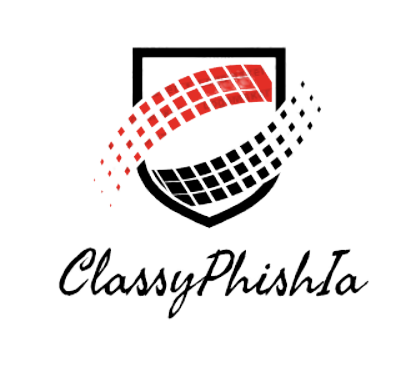

<p align = "center">

</p>

## 🤖 ClassyPhishIA

Cet outil analyse à l'aide du machine learning, des sites de phishing et les compares à des sites légitimes afin de détecter des similarités.

## Capture-d'écran


## 📃 Fonctionnalités

Les fonctionnalités actuellement disponible dans l'outil sont :
* Scanner un site à partir d'une URL insérée.
* Permettre une analyse supplémentaire avec VirusTotal (nécessite au préalable la détention d'une clé API).
* Consulter une page d'analyse qui référence l'ensemble des résultats et statistiques générales.
* Signaler le site au gouvernement en cas de soupçons.

## 🔧 Aspect technique de l'outil

### 🧠 Le machine learning
Pour fonctionner, ClassyPhishIA s'appuie sur :
* Un apprentissage supervisé (utilise des données annotés et préparés)
* Un modèle de Classification (faire une prédiction en fonction de caractéristiques)
* Un algorithme de régression logistique (interprétation par des variables unique à coefficient)

### 📊 Données analysés 

Pour réaliser une prédiction, le modèle de ClassyPhishIA se base sur divers artéfacts de sites web :
* Logo
* URL
* URL balises
* Mots-clés
* Certificats
* Balises HTML

### Affichage & intéractions sous Flask/SQLite

ClassyPhishIA utilise le framework web Flask, qui permet de créer facilement des applications et des sites locaux d'une façon légère et extensible. Il intéragit avec la base de données SQLite pour afficher les données.

## 🛠️ Installation

#### Avec un Makefile (pour Linux🐧)
```
git clone https://github.com/Maths354/ClassyPhishIA.git
cd ClassyPhishIA/
make
```

#### Avec Powershell (pour Windows🪟)
```
git clone https://github.com/Maths354/ClassyPhishIA.git
cd ClassyPhishIA/
.\build.ps1 -target all
```
:warning: Un environnement venv Python est créé afin de vous permettre d'exécuter et d'utiliser l'outil correctement, sans casser les distributions Python présentes sur votre système.
## 🗃️ Insertions des données dans la base

#### Avec un Makefile (pour Linux🐧)
```
make add_datas
```

#### Avec Powershell (pour Windows🪟)
```
.\build.ps1 -target add_datas
```
:warning: Les sites insérés dans la base de données font parti d'une liste de sites légitimes et vérifiés stockés sous la forme d'un fichier texte accessible dans 'inject_db/official_sites_XXX.txt'. La durée d'insertion des données dépends de la quantité de sites, mais aussi des sécurités présentes qui peuvent empêchés la récupération des données complètes. Egalement, il est possible qu'un banissement soit réalisé à votre encontre si trop de requêtes sont effectués à partir d'une même IP, nous vous conseillons donc d'insérer les sites par petites quantités afin d'éviter tout disfonctionnement.

## ✅ Lancement de l'outil

### 📚 CLI Example

#### Avec un Makefile (pour Linux🐧)
```
make run
```

#### Avec Powershell (pour Windows🪟)
```
.\build.ps1 -target run
```

### 📈 Affichage attendu

AJOUTER UN GIF QUI MONTRE LE PROCESS DANALYSE

## Remerciements spéciaux

* Nous tenons à remercier toutes les personnes qui nous ont soutenus tout au long de notre projet. 

* Nous exprimons notre profonde gratitude à notre tuteur, M. Maxime Aubry, dont la connaissance approfondie de la formation, des aspects techniques et des attentes du jury nous a permis de nous organiser plus efficacement et de préparer le projet de manière optimale. 

* Nous remercions également l’ensemble des intervenants de la formation pour leurs précieuses informations sur les différentes méthodes de machine learning. 

* Enfin, nous remercions chaleureusement Aurélien de la société Orange Innovation pour avoir répondu à certaines de nos questions et nous avoir apporté son éclairage.

## Information

Ce projet est destiné uniquement à des fins éducatives et défensives. Les créateurs et contributeurs ne sont pas responsables de toute utilisation abusive ou malveillante de cet outil. Utilisez-le de manière responsable et éthique, en respectant toutes les lois et réglementations pertinentes.